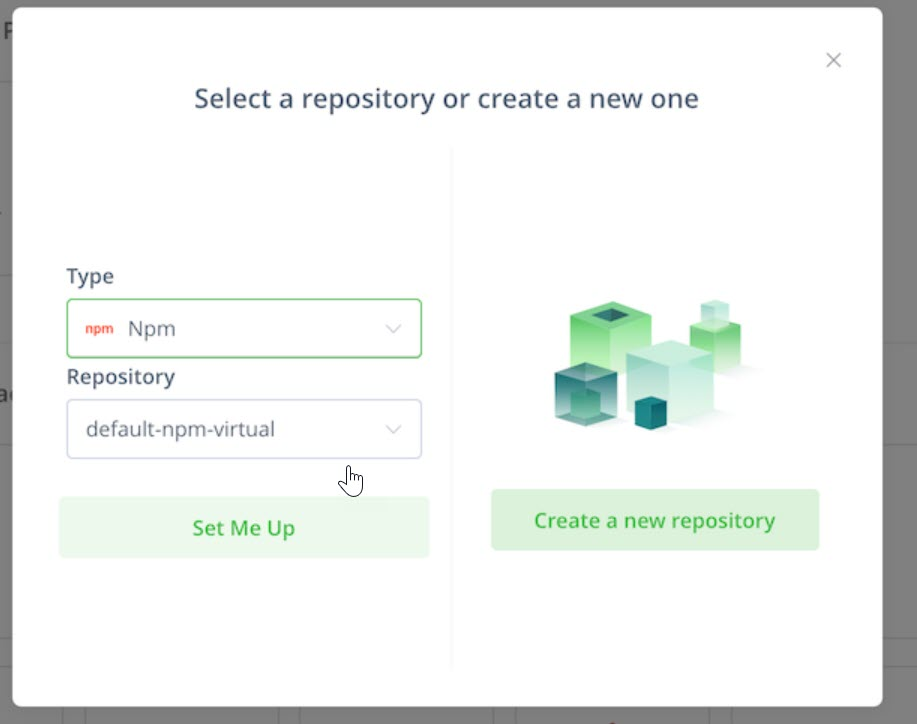
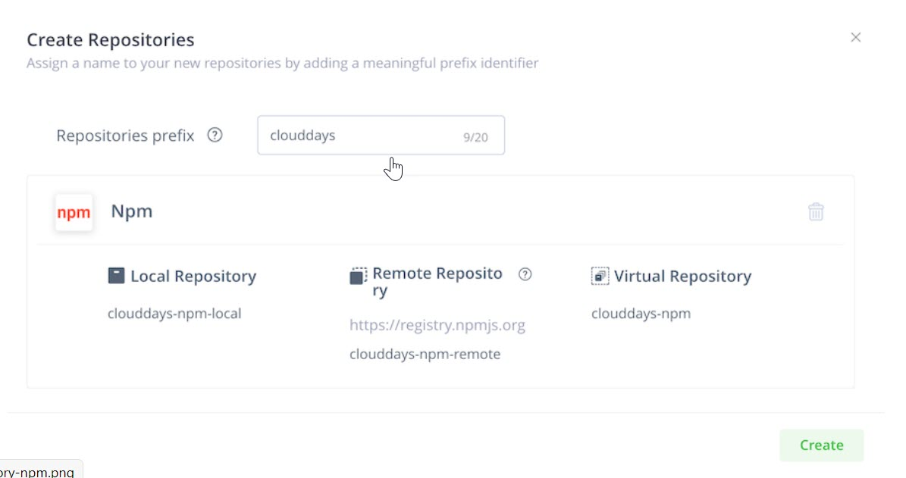

Next, we will set up a NPM and Docker repositories in Artifactory.

1. In your JFrog Platform instance go to **Administration** ► **Repositories** ► **Repositories**.

   

2. Click on **New Local Repository** on the right.

   

3. For package type, select **Docker**.

   

4. Specify _clouddays_ for the **Repository Key**.

   

5. Click **Create Local Repository**.
   
6. Next, we must create NPM repositories that will be used for NPM dependencies. JFrog provides an easy _Quick Setup_ option for this. Go to your profile and select **Quick Setup**. 

   

7. Select **NPM**.

   
   
8. Select **Create a new repository** option. 

   

9. Add **clouddays** as repository prefix and then click **create**. This create default NPM repositories including a remote repository for npmjs.

   

> **Note** Three different types of repositories can be created: local, remote and virtual. **Local repositories** are physical, locally-managed repositories into which you can deploy artifacts. These are repositories that are local to the JFrog Artifactory instance. A **remote repository** serves as a caching proxy for a repository managed at a remote URL (which may itself be another Artifactory remote repository). A **virtual repository** (or "repository group") aggregates several repositories with the same package type under a common URL. A virtual repository can aggregate local and remote repositories.
